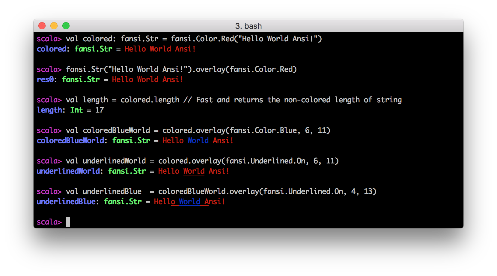
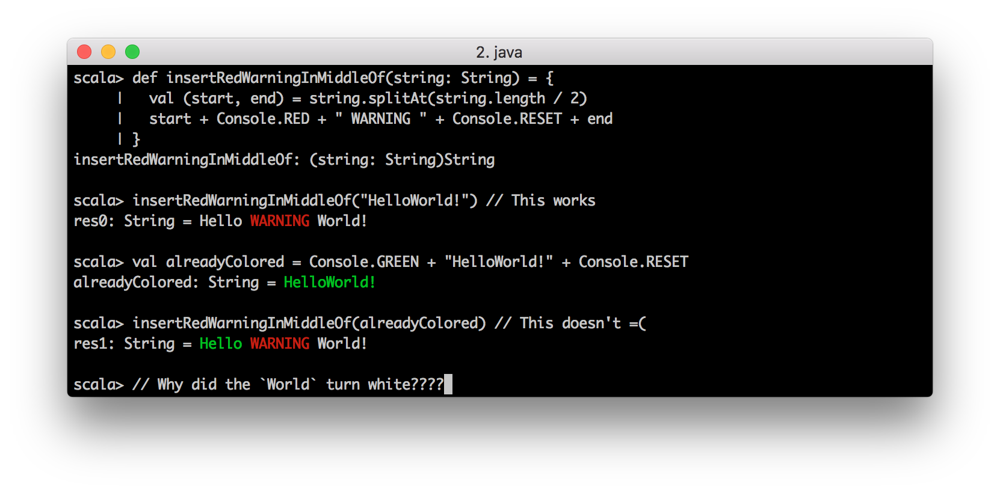
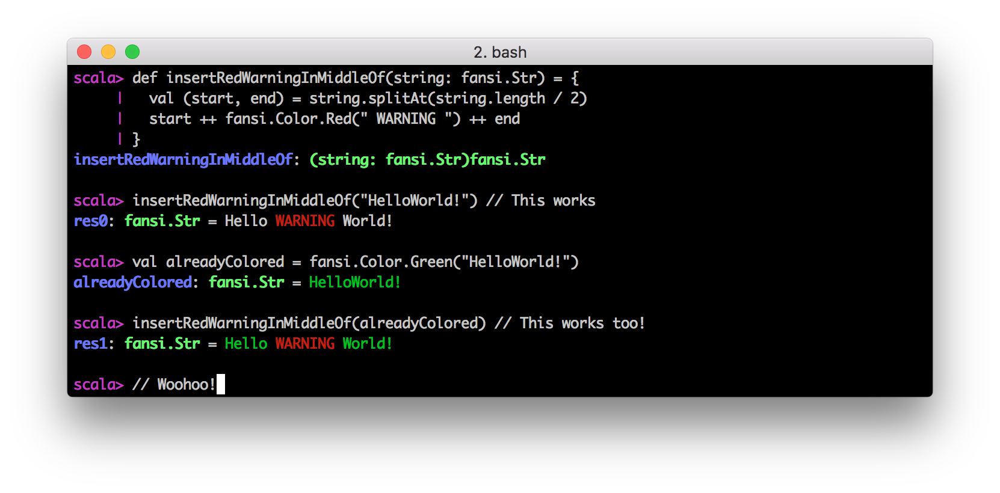
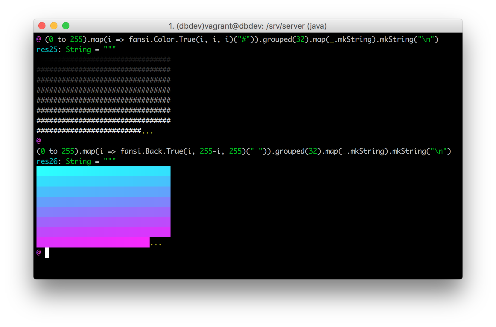

Fansi 0.2.5 [![Gitter Chat]][gitter-url] [![Build Status]][travis-url] [![Patreon][patreon-badge]][patreon-link]
======================================================================
[Gitter Chat]: https://badges.gitter.im/Join%20Chat.svg
[gitter-url]: https://gitter.im/lihaoyi/fansi?utm_source=badge&utm_medium=badge&utm_campaign=pr-badge&utm_content=badge
[Build Status]: https://travis-ci.org/lihaoyi/fansi.svg
[travis-url]: https://travis-ci.org/lihaoyi/fansi

[patreon-badge]: https://img.shields.io/badge/patreon-sponsor-ff69b4.svg
[patreon-link]: https://www.patreon.com/lihaoyi



```scala
"com.lihaoyi" %% "fansi" % "0.2.5"
"com.lihaoyi" %%% "fansi" % "0.2.5" // Scala.js or Scala-Native
```

Fansi is a Scala library to make it easy to deal with fancy colored Ansi 
strings within your command-line programs.

While "normal" use of Ansi escapes with `java.lang.String`, you find yourself 
concatenating colors:

```scala
val colored = Console.RED + "Hello World Ansi!" + Console.RESET
```

To build your colored string. This works the first time, but is error prone
on larger strings: e.g. did you remember to put a `Console.RESET` where it's
necessary? Do you need to end with one to avoid leaking the color to the entire
console after printing it?

Furthermore, some operations are fundamentally difficult or error-prone with
this approach. For example,

```scala
val colored: String = Console.RED + "Hello World Ansi!" + Console.RESET

// How to efficiently get the length of this string on-screen? We could try
// using regexes to remove and Ansi codes, but that's slow and inefficient. 
// And it's easy to accidentally call `colored.length` and get a invalid length
val length = ??? 

// How to make the word `World` blue, while preserving the coloring of the 
// `Ansi!` text after? What if the string came from somewhere else and you 
// don't know what color that text was originally?
val blueWorld = ??? 

// What if I want to underline "World" instead of changing it's color, while
// still preserving the original color?
val underlinedWorld = ???

// What if I want to apply underlines to "World" and the two characters on 
// either side, after I had already turned "World" blue?
val underlinedBlue = ???
```

While simple to describe, these tasks are all error-prone and difficult to
do using normal `java.lang.String`s containing Ansi color codes. This is 
especially so if, unlike the toy example above, `colored` is coming from some
other part of your program and you're not sure what or how-many Ansi color 
codes it already contains. 

With Fansi, doing all these tasks is simple, error-proof and efficient:

```scala
val colored: fansi.Str = fansi.Color.Red("Hello World Ansi!")
// Or fansi.Str("Hello World Ansi!").overlay(fansi.Color.Red) 

val length = colored.length // Fast and returns the non-colored length of string

val blueWorld = colored.overlay(fansi.Color.Blue, 6, 11)

val underlinedWorld = colored.overlay(fansi.Underlined.On, 6, 11)

val underlinedBlue = blueWorld.overlay(fansi.Underlined.On, 4, 13)
```

And it just works:


Why Fansi?
----------

Unlike normal `java.lang.String`s with Ansi escapes embedded inside,
`fansi.Str` allows you to perform a range of operations in an efficient
manner:

- Extracting the non-Ansi `plainText` version of the string

- Get the non-Ansi `length`

- Concatenate colored Ansi strings without worrying about leaking
  colors between them

- Applying colors to certain portions of an existing `fansi.Str`,
  and ensuring that the newly-applied colors get properly terminated
  while existing colors are unchanged

- Splitting colored Ansi strings at a `plainText` index

- Rendering to colored `java.lang.String`s with Ansi escapes embedded,
  which can be passed around or concatenated without worrying about
  leaking colors.

These are tasks which are possible to do with normal `java.lang.String`,
but are tedious, error-prone and typically inefficient. Often, you can get
by with adding copious amounts of `Console.RESET`s when working with colored
`java.lang.String`s, but even that easily results in errors when you `RESET`
too much and stomp over colors that already exist:



`fansi.Str` allows you to perform these tasks safely and easily:
 


Fansi is also very efficient: `fansi.Str` uses just 3x as much memory as
`java.lang.String` to hold all the additional formatting information.
Its operations are probably about the same factor slower, as they are all 
implemented using fast `arraycopy`s and while-loops similar to 
`java.lang.String`. That means that - unlike fiddling with Ansi-codes using 
regexes - you generally do not need to worry about performance when dealing with 
`fansi.Str`s. Just treat them as you would `java.lang.String`s: splitting them,
`substring`ing them, and applying or removing colors or other styles at-will.

Fansi was originally a part of the [Ammonite REPL](http://www.lihaoyi.com/Ammonite/),
but is now a standalone zero-dependency library anyone can use if they want
to easily and efficiently deal with colored Ansi strings.

Using Fansi
-----------

The main operations you need to know are:

- `fansi.Str(raw: CharSequence): fansi.String`, to construct colored
  Ansi strings from a `java.lang.String`, with or without existing Ansi
  color codes inside it.

- `fansi.Str`, the primary data-type that you will use to pass-around
  colored Ansi strings and manipulate them: concatenating, splitting,
  applying or removing colors, etc.


- `fansi.Attr`s are the individual modifications you can make to an 
  `fansi.Str`'s formatting. Examples are: 
    - `fansi.Bold.{On, Off}`
    - `fansi.Reversed.{On, Off}`
    - `fansi.Underlined.{On, Off}` 
    - `fansi.Color.*` 
    - `fansi.Back.*` 
    - `fansi.Attr.Reset`
  


- `fansi.Attrs` represents a group of zero or more `fansi.Attr`s. 
  These that can be passed around together, combined via `++` or applied 
  to `fansi.Str`s all at once. Any individual `fansi.Attr` can be used 
  when `fansi.Attrs` is required, as can `fansi.Attrs.empty`. 


- Using any of the `fansi.Attr` or `fansi.Attrs` mentioned above, e.g. 
  `fansi.Color.Red`, using `fansi.Color.Red("hello world ansi!")` to create a 
  `fansi.Str` with that text and color, or 
  `fansi.Str("hello world ansi!").overlay(fansi.Color.Blue, 6, 11)`

- `.render` to convert a `fansi.Str` back into a `java.lang.String` with all
  necessary Ansi color codes within it

Fansi also supports 8-bit 256-colors through `fansi.Color.Full` and
`fansi.Back.Full`, as well as 24-bit 16-million-colors through
`fansi.Color.True` and `fansi.Back.True`:



Note that Fansi only performs the rendering of the colors to an ANSI-encoded
string. Final rendering will depend on whichever terminal you print the string
to, whether it is able to display these sets of colors or not.

Digging Deeper
--------------

If you want to dig into deeper, there are a few more APIs you can use:


- `fansi.Str.join(args: fansi.Str*)` to conveniently join together multiple
  `fansi.Str`s all at once, more efficient than `++` for large numbers of 
   inputs
- `getColors`/`getColor` and `getChars`/`getChar` methods on `fansi.Str` to 
  extract the raw data for your own use
- `fansi.Str.fromArrays` to piece it back together 

This allows you to perform fast, mutable array operations on the 
color/character arrays if you know what you're doing and want to perform 
operations that are inconvenient or slow to do through `fansi.Str`'s immutable 
API. For example, if you want to do a bunch of work with colored strings and 
then at-the-end render everything to HTML, you can manually walk over the 
color/character arrays yourself and decide where to print HTML tags to give
the text colors.

`fansi.Str` currently has a relatively skeletal API: it is slightly smaller
than what `java.lang.String` has, and definitely much less than what is 
available on `scala.RichString`'s extension methods. Feel free to implement
your own custom operations using `fromArrays` if you can't find what you want
on `fansi.Str`, or send a patch if you think it's arguably general enough to
be included in Fansi itself.

- `fansi.Attrs.emitAnsiCodes` Lets you manually emit the different 
  `java.lang.String`s that correspond to changes in color in an Ansi string.

For example, if you want to emit the Ansi codes that correspond to the 
transition from "No Color" to "Red", you can use 

```scala
fansi.Attrs.emitAnsiCodes(0, fansi.Color.Red.applyMask) // "\u001b[31m"
```

Or the Ansi codes from "Red" to "No Color"

```scala
fansi.Attrs.emitAnsiCodes(fansi.Color.Red.applyMask, 0) // "\u001b[39m"
```

Or for any other combination of attributes

```scala
val attrs = fansi.Color.Red ++ fansi.Back.Blue ++ fansi.Underlined.On
fansi.Attrs.emitAnsiCodes(0, attrs.applyMask) // "\u001b[31m\u001b[44m\u001b[4m"
```

You can also pass in an `errorMode` when parsing a string via `ansi.Str(...)`
to tell Fansi how to behave if it finds Ansi escapes it can't handle. You
have the options:

- `fansi.ErrorMode.Throw` is the default, to throw an exception and fail the 
  parse if it sees an Ansi escape it does not recognize.
- `fansi.ErrorMode.Sanitize` to remove the escape character but leave the
  remnants of the escape-sequence in the result that people can see
- `fansi.ErrorMode.Strip` to remove those escape sequences entirely so that
  no trace of them remains in the final result

Scaladoc
--------

- [0.2.0](http://lihaoyi.github.io/fansi/api)

Changelog
---------

### 0.2.7

- Support for Scala 2.13.0 final

### 0.2.5

- Support for Scala-Native

### 0.2.4

- Added `fansi.Str.join`, `fansi.Str#getChar`, `fansi.Str#getColor`
- Created a [Patreon Page][patreon-link]
  to raise money to try and fund the development of Fansi, PPrint, Ammonite and my other
  open-source libraries. If you've use these libraries in the past and enjoyed doing so,
  please [chip in][patreon-link] to support development!


### 0.2.3

- Publish for Scala 2.12

### 0.2.2

- Reduce memory usage by 134mb by not initializing huge lookup tables to
  parse truecolor colors.

### 0.2.1

- Fix #7: Parsing of true colors broken

### 0.2.0

- Added the `fansi.Color.True` and `fansi.Back.True` colors, allowing you to
  specify `Attr`s that represent the 24-bit 16-million-color "True Color"
  range.

### 0.1.3

- Fixed a bug in `substring` that incorrectly threw an out of bounds exception
  for `end == length`
- Exposed the `fansi.Attrs.emitAnsiCodes` function
- Renamed `Attrs.empty` to `Attrs.Empty` for consistency with all the others

### 0.1.2

- Removed infinite-loop if parsing strings with Ansi escapes that are not 
  recognized by Fansi
- Added `fansi.ErrorMode` parameter, to control behavior when un-recognized 
  Ansi escapes are found.

### 0.1.1

- Doubled the speed of the `.render` operation
- Doubled the speed of the `.overlay` operation
- Added the `.overlayAll` method on `fansi.Str`, to allow you to quickly apply
  multiple overlays onto the same string

### 0.1.0

- First release
